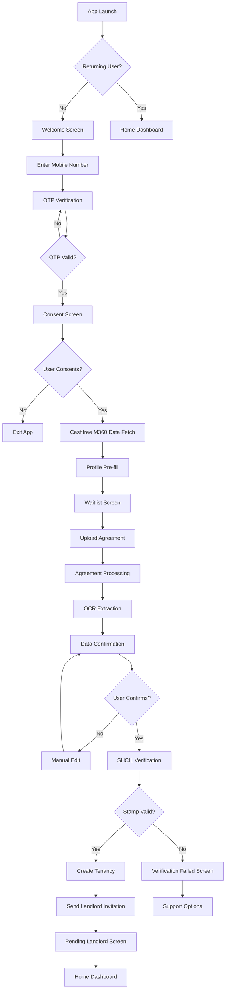

# F01: Tenant Onboarding Flow

---
doc_type: flow
flow_id: F01
entities: [tenant, agreement, property]
integrations: [cashfree_m360, google_vision, gemini, msg91, shcil]
status: approved
screens: [S01-S08]
---

## 📋 Flow Overview

**Goal:** Get tenant from app install to verified tenancy
**Duration:** 5-10 minutes (excluding landlord confirmation)
**Entry Point:** App launch (first time)
**Exit Point:** Tenancy created, landlord invitation sent

---

## 🗺️ Flow Diagram



---

## 📱 Screen Specifications

### S01: Welcome Screen

```
┌─────────────────────────────────────────────────────────────────┐
│                                                                 │
│                          [Logo]                                 │
│                                                                 │
│                      Welcome to Secured                         │
│                                                                 │
│              Pay rent. Earn cashback. Stay protected.           │
│                                                                 │
│                                                                 │
│                    ┌─────────────────┐                         │
│                    │   Get Started   │                         │
│                    └─────────────────┘                         │
│                                                                 │
│                Already have an account? Sign in                 │
│                                                                 │
└─────────────────────────────────────────────────────────────────┘
```

**Data Points:**
| Field | Type | Source | Required |
|-------|------|--------|----------|
| - | - | - | - |

**Actions:**
| Action | Trigger | Next Screen |
|--------|---------|-------------|
| Get Started | Tap button | S02 |
| Sign In | Tap link | S02 |

---

### S02: Phone Entry Screen

```
┌─────────────────────────────────────────────────────────────────┐
│  ←                                                              │
├─────────────────────────────────────────────────────────────────┤
│                                                                 │
│                    Enter your mobile number                     │
│                                                                 │
│           We'll send you a verification code                    │
│                                                                 │
│                                                                 │
│           ┌─────┬─────────────────────────────┐                │
│           │ +91 │                             │                │
│           └─────┴─────────────────────────────┘                │
│                                                                 │
│                                                                 │
│           ┌─────────────────────────────────────┐              │
│           │         Send OTP                    │              │
│           └─────────────────────────────────────┘              │
│                                                                 │
│                                                                 │
│  By continuing, you agree to our Terms of Service               │
│  and Privacy Policy                                             │
│                                                                 │
└─────────────────────────────────────────────────────────────────┘
```

**Data Points:**
| Field | Type | Validation | Required |
|-------|------|------------|----------|
| `mobile_number` | String(10) | Indian mobile regex | Yes |
| `country_code` | String | Default: +91 | Yes |

**Validation Rules:**
```javascript
{
  mobile_number: {
    pattern: /^[6-9]\d{9}$/,
    error: "Please enter a valid 10-digit mobile number"
  }
}
```

**Actions:**
| Action | Trigger | API Call | Next Screen |
|--------|---------|----------|-------------|
| Send OTP | Tap button | `POST /auth/send-otp` | S03 |
| Back | Tap ← | - | S01 |

**API Call:**
```json
POST /api/auth/send-otp
{
  "mobile": "9876543210",
  "channel": "SMS"  // or "WHATSAPP"
}

Response:
{
  "success": true,
  "request_id": "uuid",
  "expires_in": 300
}
```

---

### S03: OTP Verification Screen

```
┌─────────────────────────────────────────────────────────────────┐
│  ←                                                              │
├─────────────────────────────────────────────────────────────────┤
│                                                                 │
│                    Verify your number                           │
│                                                                 │
│           Enter the 6-digit code sent to                        │
│           +91 98765 43210                                       │
│                                                                 │
│                                                                 │
│           ┌───┐ ┌───┐ ┌───┐ ┌───┐ ┌───┐ ┌───┐                 │
│           │   │ │   │ │   │ │   │ │   │ │   │                 │
│           └───┘ └───┘ └───┘ └───┘ └───┘ └───┘                 │
│                                                                 │
│                                                                 │
│                    Resend code (0:45)                           │
│                                                                 │
│           ┌─────────────────────────────────────┐              │
│           │         Verify                      │              │
│           └─────────────────────────────────────┘              │
│                                                                 │
│                                                                 │
│           Didn't receive code? Try WhatsApp                     │
│                                                                 │
└─────────────────────────────────────────────────────────────────┘
```

**Data Points:**
| Field | Type | Validation | Required |
|-------|------|------------|----------|
| `otp` | String(6) | Numeric only | Yes |
| `request_id` | String | From previous screen | Yes |

**State:**
| State | Value | Behavior |
|-------|-------|----------|
| `resend_timer` | 45 seconds | Countdown, then enable resend |
| `attempts` | 0-3 | Block after 3 failed attempts |

**Actions:**
| Action | Trigger | API Call | Next Screen |
|--------|---------|----------|-------------|
| Verify | Tap button / Auto on 6 digits | `POST /auth/verify-otp` | S04 |
| Resend | Tap link (after timer) | `POST /auth/send-otp` | Stay |
| Try WhatsApp | Tap link | `POST /auth/send-otp` (channel: WHATSAPP) | Stay |
| Back | Tap ← | - | S02 |

**API Call:**
```json
POST /api/auth/verify-otp
{
  "mobile": "9876543210",
  "otp": "123456",
  "request_id": "uuid"
}

Response (Success):
{
  "success": true,
  "user_id": "uuid",
  "is_new_user": true,
  "access_token": "jwt_token",
  "refresh_token": "refresh_token"
}

Response (Failure):
{
  "success": false,
  "error": "INVALID_OTP",
  "attempts_remaining": 2
}
```

**Error States:**
| Error | Display | Action |
|-------|---------|--------|
| Invalid OTP | Shake animation + "Incorrect code" | Clear input |
| Expired OTP | "Code expired" | Show resend immediately |
| Max attempts | "Too many attempts" | Block 15 min, show timer |

---

### S04: Data Consent Screen

```
┌─────────────────────────────────────────────────────────────────┐
│  ←                                                              │
├─────────────────────────────────────────────────────────────────┤
│                                                                 │
│                    Quick Setup                                  │
│                                                                 │
│           To provide you the best experience, we need           │
│           to verify your identity and fetch some details.       │
│                                                                 │
│           ┌─────────────────────────────────────────────────┐  │
│           │  We will access:                                │  │
│           │                                                 │  │
│           │  ✓ Basic identity verification                  │  │
│           │  ✓ Name and contact details                     │  │
│           │  ✓ Employment information (if available)        │  │
│           │                                                 │  │
│           │  This data is used only for:                    │  │
│           │  • Verifying your profile                       │  │
│           │  • Pre-filling your details                     │  │
│           │                                                 │  │
│           │  📄 View full consent details                   │  │
│           └─────────────────────────────────────────────────┘  │
│                                                                 │
│           ┌─────────────────────────────────────────────────┐  │
│           │ ☐ I authorize Secured to verify my identity    │  │
│           │   and fetch my details as described above      │  │
│           └─────────────────────────────────────────────────┘  │
│                                                                 │
│           ┌─────────────────────────────────────────────────┐  │
│           │         Continue                                │  │
│           └─────────────────────────────────────────────────┘  │
│                                                                 │
│                    Skip for now                                 │
│                                                                 │
└─────────────────────────────────────────────────────────────────┘
```

**Data Points:**
| Field | Type | Validation | Required |
|-------|------|------------|----------|
| `consent_given` | Boolean | Must be true to continue | Yes |
| `consent_timestamp` | ISO DateTime | Auto-captured | Yes |
| `consent_version` | String | "v1.0" | Yes |
| `consent_ip` | String | Auto-captured | Yes |

**Actions:**
| Action | Trigger | API Call | Next Screen |
|--------|---------|----------|-------------|
| Continue | Tap (consent checked) | `POST /api/consent` + Cashfree M360 | S05 (Loading) → S06 |
| Skip | Tap link | - | S06 (empty profile) |
| View Details | Tap link | - | Modal with full consent text |
| Back | Tap ← | - | S03 |

**Consent Storage:**
```json
POST /api/consent
{
  "user_id": "uuid",
  "consent_type": "IDENTITY_VERIFICATION",
  "consent_given": true,
  "consent_text": "I authorize Secured to verify my identity...",
  "consent_version": "v1.0",
  "timestamp": "2025-01-15T10:30:00Z",
  "ip_address": "192.168.1.1",
  "device_id": "device_fingerprint"
}
```

---

### S05: Loading Screen (Data Fetch)

```
┌─────────────────────────────────────────────────────────────────┐
│                                                                 │
│                                                                 │
│                                                                 │
│                                                                 │
│                         [Spinner]                               │
│                                                                 │
│                    Verifying your details...                    │
│                                                                 │
│                    This may take a few seconds                  │
│                                                                 │
│                                                                 │
│                                                                 │
│                                                                 │
└─────────────────────────────────────────────────────────────────┘
```

**Background Process:**
```javascript
// Cashfree Mobile 360 Flow
1. Call POST /cashfree/mobile360/otp/send (already verified via our OTP)
2. Since OTP already verified, use session token
3. Call POST /cashfree/mobile360/fetch-data
4. Receive: name, email, employment, etc.
5. Navigate to S06 with pre-filled data
```

**Timeout:** 30 seconds → Show error, allow retry

---

### S06: Profile Confirmation Screen

```
┌─────────────────────────────────────────────────────────────────┐
│  ←                                                              │
├─────────────────────────────────────────────────────────────────┤
│                                                                 │
│                    Confirm your details                         │
│                                                                 │
│           ┌─────────────────────────────────────────────────┐  │
│           │  Full Name                                      │  │
│           │  ┌─────────────────────────────────────────┐    │  │
│           │  │  Priya Sharma                           │    │  │
│           │  └─────────────────────────────────────────┘    │  │
│           │                                                 │  │
│           │  Email                                          │  │
│           │  ┌─────────────────────────────────────────┐    │  │
│           │  │  priya.sharma@email.com                 │    │  │
│           │  └─────────────────────────────────────────┘    │  │
│           │                                                 │  │
│           │  Date of Birth (Optional)                       │  │
│           │  ┌─────────────────────────────────────────┐    │  │
│           │  │  DD / MM / YYYY                         │    │  │
│           │  └─────────────────────────────────────────┘    │  │
│           └─────────────────────────────────────────────────┘  │
│                                                                 │
│           ┌─────────────────────────────────────────────────┐  │
│           │         Continue                                │  │
│           └─────────────────────────────────────────────────┘  │
│                                                                 │
└─────────────────────────────────────────────────────────────────┘
```

**Data Points:**
| Field | Type | Source | Editable | Required |
|-------|------|--------|----------|----------|
| `full_name` | String | Cashfree M360 | Yes | Yes |
| `email` | String | Cashfree M360 | Yes | Yes |
| `dob` | Date | Cashfree M360 | Yes | No |

**Validation:**
```javascript
{
  full_name: {
    min: 2,
    max: 100,
    pattern: /^[a-zA-Z\s]+$/,
    error: "Please enter a valid name"
  },
  email: {
    pattern: /^[^\s@]+@[^\s@]+\.[^\s@]+$/,
    error: "Please enter a valid email"
  }
}
```

**Actions:**
| Action | Trigger | API Call | Next Screen |
|--------|---------|----------|-------------|
| Continue | Tap button | `PUT /api/users/profile` | S07 |
| Back | Tap ← | - | S04 |

---

### S07: Waitlist / Agreement Upload Screen

```
┌─────────────────────────────────────────────────────────────────┐
│  ←                                                    [Profile] │
├─────────────────────────────────────────────────────────────────┤
│                                                                 │
│                    Almost there! 🎉                             │
│                                                                 │
│           Upload your rental agreement to get started           │
│                                                                 │
│           ┌─────────────────────────────────────────────────┐  │
│           │                                                 │  │
│           │              ┌─────────────┐                    │  │
│           │              │     📄      │                    │  │
│           │              │   + Upload  │                    │  │
│           │              └─────────────┘                    │  │
│           │                                                 │  │
│           │     Drag & drop or tap to upload                │  │
│           │     PDF, JPG, PNG (max 10MB)                    │  │
│           │                                                 │  │
│           └─────────────────────────────────────────────────┘  │
│                                                                 │
│           What we extract:                                      │
│           • Property address                                    │
│           • Landlord details                                    │
│           • Rent amount & dates                                 │
│           • Agreement validity                                  │
│                                                                 │
│           🔒 Your document is encrypted and secure              │
│                                                                 │
│                    I'll upload later                            │
│                                                                 │
└─────────────────────────────────────────────────────────────────┘
```

**Data Points:**
| Field | Type | Validation | Required |
|-------|------|------------|----------|
| `agreement_file` | File | PDF/JPG/PNG, max 10MB | Yes |

**Upload Flow:**
```javascript
// Resumable upload with session persistence
1. User selects file
2. Create upload session: POST /api/agreements/upload/init
3. Upload in chunks (1MB each)
4. On completion: POST /api/agreements/upload/complete
5. Trigger OCR processing
```

**Session Persistence:**
```javascript
// Store in MMKV/AsyncStorage
{
  "upload_session": {
    "session_id": "uuid",
    "file_name": "agreement.pdf",
    "total_size": 5242880,
    "uploaded_bytes": 2097152,
    "chunks_completed": [0, 1],
    "started_at": "2025-01-15T10:30:00Z"
  }
}
```

**Actions:**
| Action | Trigger | API Call | Next Screen |
|--------|---------|----------|-------------|
| Upload | Tap upload area | File picker → Upload flow | S08 (Processing) |
| Upload Later | Tap link | - | Home (Limited) |
| Back | Tap ← | - | S06 |

---

### S08: Agreement Processing Screen

```
┌─────────────────────────────────────────────────────────────────┐
│                                                                 │
│                                                                 │
│                    Processing your agreement                    │
│                                                                 │
│           ┌─────────────────────────────────────────────────┐  │
│           │                                                 │  │
│           │  ✓ Document uploaded                            │  │
│           │  ◐ Extracting text...                          │  │
│           │  ○ Identifying details                          │  │
│           │  ○ Verifying stamp                              │  │
│           │                                                 │  │
│           └─────────────────────────────────────────────────┘  │
│                                                                 │
│                    This usually takes 30-60 seconds             │
│                                                                 │
│           ┌─────────────────────────────────────────────────┐  │
│           │  📄 rental_agreement.pdf                        │  │
│           │  Uploaded just now                              │  │
│           └─────────────────────────────────────────────────┘  │
│                                                                 │
│                                                                 │
│                    ← Upload different file                      │
│                                                                 │
└─────────────────────────────────────────────────────────────────┘
```

**Background Processing:**
```javascript
// OCR Pipeline
1. Google Cloud Vision: Extract raw text
2. Gemini AI: Structure extraction
   - Property address
   - Landlord name, contact
   - Tenant name
   - Monthly rent
   - Security deposit
   - Agreement dates
   - Stamp details
3. SHCIL Verification: Validate e-stamp
4. Return structured data
```

**Processing States:**
| State | Display | Duration |
|-------|---------|----------|
| `UPLOADED` | ✓ Document uploaded | Instant |
| `EXTRACTING` | ◐ Extracting text... | 10-20s |
| `ANALYZING` | ◐ Identifying details | 10-20s |
| `VERIFYING` | ◐ Verifying stamp | 5-10s |
| `COMPLETE` | ✓ All done | → Next screen |
| `FAILED` | ✗ Error message | Show retry |

**Error Handling:**
| Error | Display | Action |
|-------|---------|--------|
| OCR Failed | "Couldn't read document" | Retry or upload different |
| Not an Agreement | "This doesn't look like a rental agreement" | Upload different |
| Stamp Invalid | "E-stamp verification failed" | Contact support |
| Timeout | "Taking longer than expected" | Retry |

---

### S09: Data Confirmation Screen

```
┌─────────────────────────────────────────────────────────────────┐
│  ←                                                              │
├─────────────────────────────────────────────────────────────────┤
│                                                                 │
│                    Confirm extracted details                    │
│                                                                 │
│           ┌─────────────────────────────────────────────────┐  │
│           │  🏠 Property                                    │  │
│           │  ──────────────────────────────────────────────│  │
│           │  302, Sunshine Apartments                       │  │
│           │  Koramangala 5th Block                          │  │
│           │  Bangalore - 560095                             │  │
│           │                                         [Edit]  │  │
│           └─────────────────────────────────────────────────┘  │
│                                                                 │
│           ┌─────────────────────────────────────────────────┐  │
│           │  👤 Landlord                                    │  │
│           │  ──────────────────────────────────────────────│  │
│           │  Name: Ramesh Kumar                             │  │
│           │  Phone: +91 98765 43210                         │  │
│           │  Email: ramesh@email.com                        │  │
│           │                                         [Edit]  │  │
│           └─────────────────────────────────────────────────┘  │
│                                                                 │
│           ┌─────────────────────────────────────────────────┐  │
│           │  💰 Rent Details                                │  │
│           │  ──────────────────────────────────────────────│  │
│           │  Monthly Rent: ₹25,000                          │  │
│           │  Security Deposit: ₹75,000                      │  │
│           │  Agreement: 15 Jan 2025 - 14 Jan 2026           │  │
│           │                                         [Edit]  │  │
│           └─────────────────────────────────────────────────┘  │
│                                                                 │
│           ┌─────────────────────────────────────────────────┐  │
│           │ ☐ I confirm these details are correct          │  │
│           └─────────────────────────────────────────────────┘  │
│                                                                 │
│           ┌─────────────────────────────────────────────────┐  │
│           │         Confirm & Continue                      │  │
│           └─────────────────────────────────────────────────┘  │
│                                                                 │
│                    Something wrong? Contact support             │
│                                                                 │
└─────────────────────────────────────────────────────────────────┘
```

**Data Points (from OCR):**
| Field | Type | Editable | Required |
|-------|------|----------|----------|
| `property.address_line_1` | String | Yes | Yes |
| `property.address_line_2` | String | Yes | No |
| `property.city` | String | Yes | Yes |
| `property.pincode` | String | Yes | Yes |
| `landlord.name` | String | Yes | Yes |
| `landlord.mobile` | String | Yes | Yes |
| `landlord.email` | String | Yes | No |
| `rent.monthly_amount` | Number | Yes | Yes |
| `rent.security_deposit` | Number | Yes | No |
| `rent.start_date` | Date | Yes | Yes |
| `rent.end_date` | Date | Yes | Yes |
| `confirmation` | Boolean | - | Yes |

**Actions:**
| Action | Trigger | API Call | Next Screen |
|--------|---------|----------|-------------|
| Confirm | Tap button | `POST /api/tenancy/create` | S10 |
| Edit | Tap [Edit] | - | Edit modal |
| Contact Support | Tap link | - | Support chat |
| Back | Tap ← | - | S08 |

---

### S10: Pending Landlord Confirmation

```
┌─────────────────────────────────────────────────────────────────┐
│                                                    [Profile] 👤 │
├─────────────────────────────────────────────────────────────────┤
│                                                                 │
│                         ⏳                                      │
│                                                                 │
│                    Waiting for landlord                         │
│                                                                 │
│           We've sent a confirmation request to                  │
│           Ramesh Kumar (+91 98765XXXXX)                         │
│                                                                 │
│           ┌─────────────────────────────────────────────────┐  │
│           │                                                 │  │
│           │  📧 Email sent                         ✓        │  │
│           │  📱 SMS sent                           ✓        │  │
│           │  💬 WhatsApp sent                      ✓        │  │
│           │                                                 │  │
│           │  Waiting for confirmation...                    │  │
│           │                                                 │  │
│           └─────────────────────────────────────────────────┘  │
│                                                                 │
│           What happens next:                                    │
│           1. Landlord clicks the link we sent                   │
│           2. They verify their details                          │
│           3. You can start paying rent!                         │
│                                                                 │
│           ┌─────────────────────────────────────────────────┐  │
│           │         Remind Landlord                         │  │
│           └─────────────────────────────────────────────────┘  │
│                                                                 │
│           Usually takes 1-2 days. You'll be notified.          │
│                                                                 │
└─────────────────────────────────────────────────────────────────┘
```

**Data Points:**
| Field | Type | Source |
|-------|------|--------|
| `landlord_name` | String | Tenancy |
| `landlord_mobile_masked` | String | +91 98765XXXXX |
| `invitation_status` | Object | API |
| `reminder_sent_count` | Number | API |
| `last_reminder_at` | DateTime | API |

**Polling:**
```javascript
// Check status every 30 seconds
GET /api/tenancy/{id}/landlord-status

Response:
{
  "status": "PENDING", // PENDING, OPENED, CONFIRMED
  "email_sent": true,
  "sms_sent": true,
  "whatsapp_sent": true,
  "opened_at": null,
  "confirmed_at": null
}
```

**Actions:**
| Action | Trigger | API Call | Behavior |
|--------|---------|----------|----------|
| Remind | Tap button | `POST /api/tenancy/{id}/remind` | Resend notifications |
| - | Auto | Poll every 30s | Update status |
| - | Push notification | - | Navigate to Home when confirmed |

---

## 🔄 State Machine

```
┌─────────────────────────────────────────────────────────────────┐
│                  TENANT ONBOARDING STATES                       │
│                                                                 │
│  ┌────────────┐                                                 │
│  │   START    │                                                 │
│  └─────┬──────┘                                                 │
│        │                                                        │
│        ▼                                                        │
│  ┌────────────┐    OTP Failed     ┌────────────┐               │
│  │ OTP_SENT   │ ─────────────────►│   FAILED   │               │
│  └─────┬──────┘                   └────────────┘               │
│        │ OTP Verified                                           │
│        ▼                                                        │
│  ┌────────────┐    No Consent     ┌────────────┐               │
│  │  CONSENT   │ ─────────────────►│  SKIPPED   │               │
│  └─────┬──────┘                   └────────────┘               │
│        │ Consented                                              │
│        ▼                                                        │
│  ┌────────────┐    Fetch Failed   ┌────────────┐               │
│  │ DATA_FETCH │ ─────────────────►│   FAILED   │               │
│  └─────┬──────┘                   └────────────┘               │
│        │ Data Fetched                                           │
│        ▼                                                        │
│  ┌────────────┐                                                 │
│  │  PROFILE   │                                                 │
│  └─────┬──────┘                                                 │
│        │ Profile Saved                                          │
│        ▼                                                        │
│  ┌────────────┐    Skip Upload    ┌────────────┐               │
│  │  WAITLIST  │ ─────────────────►│  WAITLIST  │ (Limited)     │
│  └─────┬──────┘                   └────────────┘               │
│        │ File Selected                                          │
│        ▼                                                        │
│  ┌────────────┐    Upload Failed  ┌────────────┐               │
│  │ UPLOADING  │ ─────────────────►│   FAILED   │               │
│  └─────┬──────┘                   └─────┬──────┘               │
│        │ Upload Complete                │ Retry                 │
│        ▼                                │                       │
│  ┌────────────┐    OCR Failed     ◄─────┘                      │
│  │ PROCESSING │ ─────────────────►                              │
│  └─────┬──────┘                                                 │
│        │ OCR Complete                                           │
│        ▼                                                        │
│  ┌────────────┐    Stamp Invalid  ┌────────────┐               │
│  │ CONFIRMING │ ─────────────────►│   FAILED   │               │
│  └─────┬──────┘                   └────────────┘               │
│        │ Confirmed                                              │
│        ▼                                                        │
│  ┌────────────────────┐                                        │
│  │ PENDING_LANDLORD   │ ◄──── Waiting for landlord             │
│  └─────────┬──────────┘                                        │
│            │ Landlord Confirmed                                 │
│            ▼                                                    │
│  ┌────────────┐                                                 │
│  │   ACTIVE   │ ◄──── Ready to pay rent                        │
│  └────────────┘                                                 │
│                                                                 │
└─────────────────────────────────────────────────────────────────┘
```

**State Persistence:**
```javascript
// MMKV Storage
{
  "onboarding_state": {
    "current_state": "UPLOADING",
    "user_id": "uuid",
    "profile_data": {...},
    "upload_session": {...},
    "started_at": "2025-01-15T10:30:00Z",
    "last_updated": "2025-01-15T10:35:00Z"
  }
}
```

---

## 🚨 Error Screens

### E01: OTP Max Attempts

```
┌─────────────────────────────────────────────────────────────────┐
│                                                                 │
│                         ⚠️                                      │
│                                                                 │
│                    Too many attempts                            │
│                                                                 │
│           Please wait 15 minutes before trying again.           │
│                                                                 │
│                    Time remaining: 14:32                        │
│                                                                 │
│                                                                 │
│                    Need help? Contact support                   │
│                                                                 │
└─────────────────────────────────────────────────────────────────┘
```

### E02: Agreement OCR Failed

```
┌─────────────────────────────────────────────────────────────────┐
│                                                                 │
│                         ❌                                      │
│                                                                 │
│                    Couldn't read document                       │
│                                                                 │
│           We had trouble extracting details from your           │
│           agreement. This could be because:                     │
│                                                                 │
│           • Document is blurry or low quality                   │
│           • It's not a rental agreement                         │
│           • The format isn't supported                          │
│                                                                 │
│           ┌─────────────────────────────────────────────────┐  │
│           │         Upload Different File                   │  │
│           └─────────────────────────────────────────────────┘  │
│                                                                 │
│           ┌─────────────────────────────────────────────────┐  │
│           │         Contact Support                         │  │
│           └─────────────────────────────────────────────────┘  │
│                                                                 │
└─────────────────────────────────────────────────────────────────┘
```

### E03: Stamp Verification Failed

```
┌─────────────────────────────────────────────────────────────────┐
│                                                                 │
│                         ⚠️                                      │
│                                                                 │
│                    Stamp verification failed                    │
│                                                                 │
│           We couldn't verify the e-stamp on your               │
│           agreement. This could mean:                          │
│                                                                 │
│           • The stamp is not registered with SHCIL             │
│           • The stamp details don't match                       │
│           • The agreement may not be valid                      │
│                                                                 │
│           ┌─────────────────────────────────────────────────┐  │
│           │         Upload Different Agreement              │  │
│           └─────────────────────────────────────────────────┘  │
│                                                                 │
│           ┌─────────────────────────────────────────────────┐  │
│           │         Contact Support                         │  │
│           └─────────────────────────────────────────────────┘  │
│                                                                 │
│           Think this is a mistake? Let us know.                │
│                                                                 │
└─────────────────────────────────────────────────────────────────┘
```

---

## 📊 Analytics Events

| Event | Trigger | Properties |
|-------|---------|------------|
| `onboarding_started` | App launch (new user) | `device_type`, `os_version` |
| `otp_requested` | Send OTP tapped | `channel` |
| `otp_verified` | OTP successful | `attempts`, `duration` |
| `consent_given` | Consent checkbox ticked | `consent_version` |
| `data_fetch_complete` | M360 data received | `fields_populated` |
| `profile_saved` | Profile confirmed | `fields_edited` |
| `agreement_upload_started` | File selected | `file_type`, `file_size` |
| `agreement_upload_complete` | Upload finished | `duration`, `chunks` |
| `ocr_complete` | Processing done | `duration`, `confidence` |
| `details_confirmed` | Tenant confirms | `fields_edited` |
| `landlord_invited` | Invitation sent | `channels` |
| `onboarding_complete` | Landlord confirms | `total_duration` |

---

## 🔗 Connected Flows

| Trigger | Target Flow | Condition |
|---------|-------------|-----------|
| Landlord invited | [F02: Landlord Web](./F02_LANDLORD_WEB.md) | Always |
| Onboarding complete | [F03: Payment](./F03_PAYMENT.md) | When payment window opens |
| Profile incomplete | [F04: KYC Aadhaar](./F04_KYC_AADHAAR.md) | For cashback redemption |

