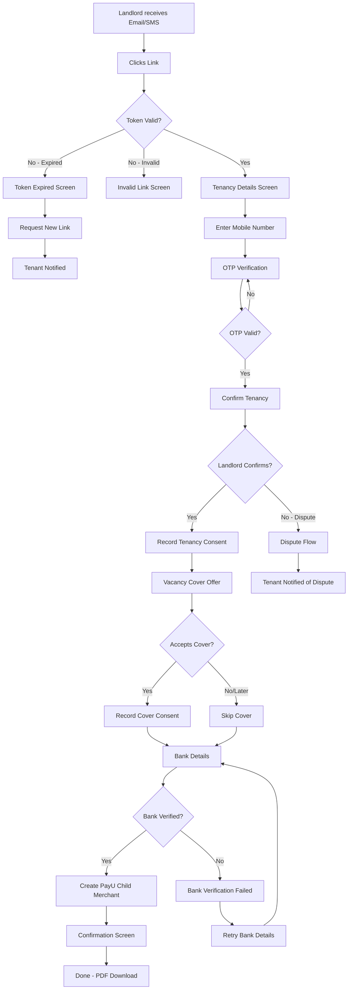

# F02: Landlord Web Flow

---
doc_type: flow
flow_id: F02
entities: [landlord, tenancy, vacancy_cover, consent]
integrations: [msg91, penny_drop, payu]
status: approved
platform: web
screens: [W01-W06]
---

## 📋 Flow Overview

**Goal:** Get landlord to confirm tenancy and accept vacancy cover
**Duration:** 2-3 minutes
**Entry Point:** Email/SMS/WhatsApp link from tenant invitation
**Exit Point:** Tenancy confirmed, vacancy cover accepted (or declined)

**Important:** This is a web-based flow, separate from the mobile app architecture.

---

## 🗺️ Flow Diagram



---

## 📧 Trigger: Landlord Invitation

### Email Template

```
From: notifications@secured.app
To: {landlord_email}
Subject: {tenant_name} has listed you as their landlord on Secured

─────────────────────────────────────────────────────────────────

Hi {landlord_name},

{tenant_name} is using Secured to pay rent for the property at:
{property_address}

They've listed you as the landlord.

Please confirm this tenancy to enable:
✓ On-time rent payments directly to your bank
✓ Vacancy Assurance Cover worth ₹1,50,000 (FREE)

👉 Confirm Tenancy: {confirmation_link}

This link expires in 7 days.

Questions? Reply to this email.

─────────────────────────────────────────────────────────────────
Secured | Making rent payments safer
```

### SMS Template (DLT Registered)

```
Hi {landlord_name}, {tenant_name} has listed you as their landlord
on Secured. Confirm to enable Vacancy Cover worth Rs 1.5L: {short_link}
- Team Secured
```

### WhatsApp Template

```
🏠 *Secured - Landlord Confirmation*

Hi {landlord_name},

{tenant_name} has listed you as the landlord for:
📍 {property_address}

Confirm your tenancy to enable:
✅ On-time rent payments to your bank
✅ FREE Vacancy Cover worth ₹1,50,000

👉 Tap to confirm: {confirmation_link}

_This link expires in 7 days._
```

---

## 🌐 Web Screens

### W01: Token Validation (Background)

**URL:** `landlord.secured.app/confirm/{token}`

**API Call:**
```json
GET /api/landlord/validate-token/{token}

Response (Valid):
{
  "valid": true,
  "tenancy_id": "uuid",
  "tenant_name": "Priya Sharma",
  "property": {
    "address_line_1": "302, Sunshine Apartments",
    "address_line_2": "Koramangala 5th Block",
    "city": "Bangalore",
    "pincode": "560095"
  },
  "rent_amount": 25000,
  "agreement_period": {
    "start": "2025-01-15",
    "end": "2026-01-14"
  },
  "landlord_prefill": {
    "name": "Ramesh Kumar",
    "mobile": "9876543210",
    "email": "ramesh@email.com"
  },
  "expires_at": "2025-01-22T10:30:00Z"
}

Response (Expired):
{
  "valid": false,
  "error": "TOKEN_EXPIRED",
  "expired_at": "2025-01-20T10:30:00Z"
}

Response (Invalid):
{
  "valid": false,
  "error": "TOKEN_INVALID"
}
```

---

### W02: Tenancy Confirmation Form

```
┌─────────────────────────────────────────────────────────────────────────────┐
│  [Secured Logo]                                                             │
├─────────────────────────────────────────────────────────────────────────────┤
│                                                                             │
│                        Confirm Your Tenancy                                 │
│                        ─────────────────────                                │
│                                                                             │
│  {tenant_name} has listed you as the landlord for:                         │
│                                                                             │
│  ┌─────────────────────────────────────────────────────────────────────┐   │
│  │  📍 Property Details                                                │   │
│  │  ───────────────────────────────────────────────────────────────── │   │
│  │  Address:    302, Sunshine Apartments                               │   │
│  │              Koramangala 5th Block, Bangalore - 560095              │   │
│  │  Tenant:     Priya Sharma                                           │   │
│  │  Rent:       ₹25,000 / month                                        │   │
│  │  Period:     15 Jan 2025 - 14 Jan 2026                              │   │
│  └─────────────────────────────────────────────────────────────────────┘   │
│                                                                             │
│  ┌─────────────────────────────────────────────────────────────────────┐   │
│  │  Your Details                                                       │   │
│  │  ───────────────────────────────────────────────────────────────── │   │
│  │                                                                     │   │
│  │  Full Name *                                                        │   │
│  │  ┌─────────────────────────────────────────────────────────────┐   │   │
│  │  │  Ramesh Kumar                                               │   │   │
│  │  └─────────────────────────────────────────────────────────────┘   │   │
│  │                                                                     │   │
│  │  Mobile Number * (for OTP verification)                             │   │
│  │  ┌───────┬─────────────────────────────────────────────────────┐   │   │
│  │  │  +91  │  9876543210                                         │   │   │
│  │  └───────┴─────────────────────────────────────────────────────┘   │   │
│  │                                                                     │   │
│  │  Email (optional)                                                   │   │
│  │  ┌─────────────────────────────────────────────────────────────┐   │   │
│  │  │  ramesh@email.com                                           │   │   │
│  │  └─────────────────────────────────────────────────────────────┘   │   │
│  │                                                                     │   │
│  └─────────────────────────────────────────────────────────────────────┘   │
│                                                                             │
│  ┌─────────────────────────────────────────────────────────────────────┐   │
│  │  ☐ I confirm that {tenant_name} is my tenant at the above          │   │
│  │    property and the rent details are accurate.                      │   │
│  └─────────────────────────────────────────────────────────────────────┘   │
│                                                                             │
│                    [ Verify via OTP & Confirm ]                            │
│                                                                             │
│  ─────────────────────────────────────────────────────────────────────────│
│  By confirming, you agree to our Terms of Service and Privacy Policy.     │
│                                                                             │
│  Not you? Click here to let us know.                                       │
│                                                                             │
└─────────────────────────────────────────────────────────────────────────────┘
```

**Data Points:**
| Field | Type | Pre-filled | Editable | Required |
|-------|------|------------|----------|----------|
| `landlord_name` | String | From OCR | Yes | Yes |
| `landlord_mobile` | String | From OCR | Yes | Yes |
| `landlord_email` | String | From OCR | Yes | No |
| `tenancy_confirmation` | Boolean | No | - | Yes |

**Validation:**
```javascript
{
  landlord_name: {
    min: 2,
    max: 100,
    required: true
  },
  landlord_mobile: {
    pattern: /^[6-9]\d{9}$/,
    required: true
  },
  landlord_email: {
    pattern: /^[^\s@]+@[^\s@]+\.[^\s@]+$/,
    required: false
  },
  tenancy_confirmation: {
    must_be: true,
    error: "Please confirm the tenancy details"
  }
}
```

**Actions:**
| Action | Trigger | API Call | Next |
|--------|---------|----------|------|
| Verify & Confirm | Button click | `POST /api/landlord/send-otp` | W03 (OTP Modal) |
| Not You | Link click | - | W02a (Report Issue) |

---

### W03: OTP Verification (Modal/Inline)

```
┌─────────────────────────────────────────────────────────────────────────────┐
│                                                                             │
│  ┌─────────────────────────────────────────────────────────────────────┐   │
│  │                                                                     │   │
│  │                    Verify Your Number                               │   │
│  │                                                                     │   │
│  │           Enter the 6-digit code sent to                            │   │
│  │           +91 98765 43210                                           │   │
│  │                                                                     │   │
│  │           ┌───┐ ┌───┐ ┌───┐ ┌───┐ ┌───┐ ┌───┐                     │   │
│  │           │   │ │   │ │   │ │   │ │   │ │   │                     │   │
│  │           └───┘ └───┘ └───┘ └───┘ └───┘ └───┘                     │   │
│  │                                                                     │   │
│  │                    Resend code (0:45)                               │   │
│  │                                                                     │   │
│  │                    [ Confirm Tenancy ]                              │   │
│  │                                                                     │   │
│  │           Didn't receive? Try SMS instead                           │   │
│  │                                                                     │   │
│  └─────────────────────────────────────────────────────────────────────┘   │
│                                                                             │
└─────────────────────────────────────────────────────────────────────────────┘
```

**API Call:**
```json
POST /api/landlord/send-otp
{
  "mobile": "9876543210",
  "tenancy_id": "uuid",
  "channel": "WHATSAPP"  // or "SMS"
}

POST /api/landlord/verify-otp
{
  "mobile": "9876543210",
  "otp": "123456",
  "tenancy_id": "uuid"
}

Response (Success):
{
  "success": true,
  "landlord_id": "uuid",  // Created or existing
  "is_new_landlord": true
}
```

**On Success:** Record tenancy confirmation consent → Navigate to W04

**Consent Recording:**
```json
POST /api/landlord/consent
{
  "landlord_id": "uuid",
  "tenancy_id": "uuid",
  "consent_type": "TENANCY_CONFIRMATION",
  "consent_given": true,
  "consent_text": "I confirm that Priya Sharma is my tenant at 302, Sunshine Apartments...",
  "consent_version": "v1.0",
  "ip_address": "auto",
  "user_agent": "auto"
}
```

---

### W04: Vacancy Cover Offer

```
┌─────────────────────────────────────────────────────────────────────────────┐
│  [Secured Logo]                                                    ✓ Step 1 │
├─────────────────────────────────────────────────────────────────────────────┤
│                                                                             │
│                        ✓ Tenancy Confirmed!                                │
│                                                                             │
│  ─────────────────────────────────────────────────────────────────────────│
│                                                                             │
│                    Activate Your Vacancy Assurance Cover                   │
│                    ─────────────────────────────────────                    │
│                                                                             │
│  As {tenant_name}'s landlord, you're eligible for:                         │
│                                                                             │
│  ┌─────────────────────────────────────────────────────────────────────┐   │
│  │                                                                     │   │
│  │  🛡️  Vacancy Assurance Cover                                        │   │
│  │  ───────────────────────────────────────────────────────────────── │   │
│  │                                                                     │   │
│  │  Cover Amount:      ₹1,50,000                                       │   │
│  │  Premium:           ₹0 (Paid by Secured)                            │   │
│  │  Activates After:   3 successful rent payments                      │   │
│  │  Valid Till:        Agreement end date (14 Jan 2026)                │   │
│  │                                                                     │   │
│  │  ───────────────────────────────────────────────────────────────── │   │
│  │                                                                     │   │
│  │  ✅ What's Covered:                                                 │   │
│  │     • Tenant vacates without notice                                 │   │
│  │     • Rent defaults after vacancy                                   │   │
│  │     • Up to 3 months rent recovery                                  │   │
│  │                                                                     │   │
│  │  ❌ What's Not Covered:                                             │   │
│  │     • Property damage                                               │   │
│  │     • Disputes unrelated to vacancy                                 │   │
│  │     • Tenant evicted for legal cause                                │   │
│  │                                                                     │   │
│  │  📄 Read full Terms & Conditions                                    │   │
│  │                                                                     │   │
│  └─────────────────────────────────────────────────────────────────────┘   │
│                                                                             │
│  ┌─────────────────────────────────────────────────────────────────────┐   │
│  │  ☐ I have read and accept the Vacancy Assurance Terms              │   │
│  │                                                                     │   │
│  │  ☐ I consent to receive claim-related communications via           │   │
│  │    email, SMS, and WhatsApp                                        │   │
│  │                                                                     │   │
│  │  ☐ I understand the cover activates after 3 rent payments          │   │
│  └─────────────────────────────────────────────────────────────────────┘   │
│                                                                             │
│           [ Accept Vacancy Cover ]        [ Maybe Later ]                  │
│                                                                             │
│  ─────────────────────────────────────────────────────────────────────────│
│  Powered by [Insurance Partner Logo]                                       │
│                                                                             │
└─────────────────────────────────────────────────────────────────────────────┘
```

**Data Points:**
| Field | Type | Required |
|-------|------|----------|
| `cover_terms_accepted` | Boolean | Yes (if accepting) |
| `communication_consent` | Boolean | Yes (if accepting) |
| `activation_understood` | Boolean | Yes (if accepting) |

**Actions:**
| Action | Trigger | API Call | Next |
|--------|---------|----------|------|
| Accept | Button (all checked) | `POST /api/landlord/consent` (VACANCY_COVER) | W05 |
| Maybe Later | Link | Skip consent | W05 |

**Consent Recording (if accepted):**
```json
POST /api/landlord/consent
{
  "landlord_id": "uuid",
  "tenancy_id": "uuid",
  "consent_type": "VACANCY_COVER_ACCEPTANCE",
  "consent_given": true,
  "consent_text": "I accept the Vacancy Assurance Terms...",
  "consent_version": "v1.0"
}

POST /api/vacancy-cover/create
{
  "tenancy_id": "uuid",
  "landlord_id": "uuid",
  "cover_amount": 150000,
  "status": "PENDING_ACTIVATION"
}
```

---

### W05: Bank Account Details

```
┌─────────────────────────────────────────────────────────────────────────────┐
│  [Secured Logo]                                           ✓ Step 1  ✓ Step 2│
├─────────────────────────────────────────────────────────────────────────────┤
│                                                                             │
│                    Add Your Bank Account                                   │
│                    ─────────────────────                                    │
│                                                                             │
│  This is where rent payments will be settled.                              │
│                                                                             │
│  ┌─────────────────────────────────────────────────────────────────────┐   │
│  │                                                                     │   │
│  │  Account Holder Name *                                              │   │
│  │  ┌─────────────────────────────────────────────────────────────┐   │   │
│  │  │  Ramesh Kumar                                               │   │   │
│  │  └─────────────────────────────────────────────────────────────┘   │   │
│  │  (Should match your bank records)                                   │   │
│  │                                                                     │   │
│  │  Bank Account Number *                                              │   │
│  │  ┌─────────────────────────────────────────────────────────────┐   │   │
│  │  │                                                             │   │   │
│  │  └─────────────────────────────────────────────────────────────┘   │   │
│  │                                                                     │   │
│  │  Confirm Account Number *                                           │   │
│  │  ┌─────────────────────────────────────────────────────────────┐   │   │
│  │  │                                                             │   │   │
│  │  └─────────────────────────────────────────────────────────────┘   │   │
│  │                                                                     │   │
│  │  IFSC Code *                                                        │   │
│  │  ┌─────────────────────────────────────────────────────────────┐   │   │
│  │  │                                                             │   │   │
│  │  └─────────────────────────────────────────────────────────────┘   │   │
│  │  Bank: [Auto-detected from IFSC]                                    │   │
│  │                                                                     │   │
│  └─────────────────────────────────────────────────────────────────────┘   │
│                                                                             │
│  🔒 Your bank details are encrypted and secure                             │
│                                                                             │
│                    [ Verify & Continue ]                                   │
│                                                                             │
│  We'll deposit ₹1 to verify your account. This usually takes a minute.    │
│                                                                             │
└─────────────────────────────────────────────────────────────────────────────┘
```

**Data Points:**
| Field | Type | Validation | Required |
|-------|------|------------|----------|
| `account_holder_name` | String | Min 2 chars | Yes |
| `account_number` | String | 9-18 digits | Yes |
| `confirm_account_number` | String | Must match | Yes |
| `ifsc_code` | String | IFSC regex | Yes |

**Validation:**
```javascript
{
  account_number: {
    pattern: /^\d{9,18}$/,
    error: "Enter a valid account number"
  },
  confirm_account_number: {
    must_match: "account_number",
    error: "Account numbers don't match"
  },
  ifsc_code: {
    pattern: /^[A-Z]{4}0[A-Z0-9]{6}$/,
    error: "Enter a valid IFSC code"
  }
}
```

**IFSC Lookup:**
```json
GET /api/bank/ifsc/{ifsc_code}

Response:
{
  "bank_name": "HDFC Bank",
  "branch": "Koramangala Branch",
  "city": "Bangalore",
  "state": "Karnataka"
}
```

**Penny Drop Verification:**
```json
POST /api/bank/verify
{
  "account_number": "1234567890",
  "ifsc_code": "HDFC0001234",
  "account_holder_name": "Ramesh Kumar"
}

Response (Success):
{
  "success": true,
  "verified_name": "RAMESH KUMAR",
  "name_match_score": 0.95,
  "reference_id": "uuid"
}

Response (Failed):
{
  "success": false,
  "error": "ACCOUNT_NOT_FOUND",
  "message": "Could not verify account"
}
```

**Name Matching:**
```javascript
// 80% threshold for Indian names
const nameMatchThreshold = 0.80;

// Cases handled:
// "Ramesh Kumar" vs "RAMESH KUMAR" → 1.0 ✓
// "Ramesh Kumar" vs "Kumar Ramesh" → 0.85 ✓ (reordered)
// "Ramesh Kumar" vs "R Kumar" → 0.75 ✗ (below threshold)
// "Ramesh Kumar" vs "Ramesh K" → 0.82 ✓ (abbreviated)
```

**On Success:** Create PayU Child Merchant → W06

**PayU Child Merchant Creation:**
```json
POST /api/payu/create-child-merchant
{
  "landlord_id": "uuid",
  "name": "Ramesh Kumar",
  "email": "ramesh@email.com",
  "mobile": "9876543210",
  "bank_account": {
    "account_number": "1234567890",
    "ifsc_code": "HDFC0001234",
    "account_holder_name": "Ramesh Kumar"
  }
}

Response:
{
  "success": true,
  "payu_merchant_key": "child_key_xyz",
  "payu_merchant_id": "12345"
}
```

---

### W06: Confirmation / Success Screen

```
┌─────────────────────────────────────────────────────────────────────────────┐
│  [Secured Logo]                                      ✓ Step 1  ✓ Step 2  ✓ │
├─────────────────────────────────────────────────────────────────────────────┤
│                                                                             │
│                              ✓                                              │
│                                                                             │
│                        You're All Set!                                     │
│                                                                             │
│  ┌─────────────────────────────────────────────────────────────────────┐   │
│  │                                                                     │   │
│  │  Summary                                                            │   │
│  │  ───────────────────────────────────────────────────────────────── │   │
│  │                                                                     │   │
│  │  ✓ Tenancy confirmed for                                           │   │
│  │    302, Sunshine Apartments, Koramangala                            │   │
│  │                                                                     │   │
│  │  ✓ Vacancy Cover accepted                       [OR: ⏳ Skipped]   │   │
│  │    Cover Amount: ₹1,50,000                                          │   │
│  │                                                                     │   │
│  │  ✓ Bank account verified                                           │   │
│  │    HDFC Bank ****7890                                               │   │
│  │                                                                     │   │
│  │  ⏳ Vacancy Cover activates after 3 rent payments                   │   │
│  │                                                                     │   │
│  └─────────────────────────────────────────────────────────────────────┘   │
│                                                                             │
│  What happens next:                                                        │
│  ─────────────────                                                          │
│  1. {tenant_name} pays rent via Secured (1st-7th of each month)            │
│  2. Rent is settled to your bank account (T+2 days)                        │
│  3. After 3 payments, your Vacancy Cover activates                         │
│  4. We'll notify you at each step                                          │
│                                                                             │
│  ─────────────────────────────────────────────────────────────────────────│
│                                                                             │
│  Confirmation sent to:                                                     │
│  📧 ramesh@email.com                                                       │
│  📱 +91 98765 43210                                                        │
│                                                                             │
│                    [ Download Confirmation PDF ]                           │
│                                                                             │
│                    [ Add Another Property ]                                │
│                                                                             │
└─────────────────────────────────────────────────────────────────────────────┘
```

**Actions:**
| Action | Trigger | API Call | Result |
|--------|---------|----------|--------|
| Download PDF | Button | `GET /api/landlord/confirmation-pdf/{tenancy_id}` | Download file |
| Add Another | Button | - | Reset form for new tenancy |

**PDF Contents:**
- Tenancy confirmation details
- Vacancy cover terms (if accepted)
- Bank account (masked)
- Important dates
- Contact information

---

## 🚨 Error Screens

### W-E01: Token Expired

```
┌─────────────────────────────────────────────────────────────────────────────┐
│  [Secured Logo]                                                             │
├─────────────────────────────────────────────────────────────────────────────┤
│                                                                             │
│                              ⏰                                             │
│                                                                             │
│                    This link has expired                                   │
│                                                                             │
│  The confirmation link is valid for 7 days and has expired.                │
│                                                                             │
│  Don't worry! You can request a new link.                                  │
│                                                                             │
│                    [ Request New Link ]                                    │
│                                                                             │
│  The tenant ({tenant_name}) will be notified to resend                     │
│  the confirmation request.                                                 │
│                                                                             │
└─────────────────────────────────────────────────────────────────────────────┘
```

### W-E02: Bank Verification Failed

```
┌─────────────────────────────────────────────────────────────────────────────┐
│  [Secured Logo]                                                             │
├─────────────────────────────────────────────────────────────────────────────┤
│                                                                             │
│                              ⚠️                                             │
│                                                                             │
│                    Bank verification failed                                │
│                                                                             │
│  We couldn't verify your bank account. This could be because:              │
│                                                                             │
│  • Account number or IFSC is incorrect                                     │
│  • Account holder name doesn't match                                       │
│  • Account is inactive or closed                                           │
│                                                                             │
│                    [ Try Again ]                                           │
│                                                                             │
│                    [ Use Different Account ]                               │
│                                                                             │
│  Need help? Contact support@secured.app                                    │
│                                                                             │
└─────────────────────────────────────────────────────────────────────────────┘
```

### W-E03: Name Mismatch Warning

```
┌─────────────────────────────────────────────────────────────────────────────┐
│                                                                             │
│  ┌─────────────────────────────────────────────────────────────────────┐   │
│  │                                                                     │   │
│  │                         ⚠️ Name Mismatch                            │   │
│  │                                                                     │   │
│  │  The name on your bank account doesn't match exactly:               │   │
│  │                                                                     │   │
│  │  You entered:     Ramesh Kumar                                      │   │
│  │  Bank records:    RAMESH KUMAR SHARMA                               │   │
│  │                                                                     │   │
│  │  Is this still your account?                                        │   │
│  │                                                                     │   │
│  │       [ Yes, Continue ]        [ No, Edit Details ]                 │   │
│  │                                                                     │   │
│  └─────────────────────────────────────────────────────────────────────┘   │
│                                                                             │
└─────────────────────────────────────────────────────────────────────────────┘
```

---

## 🔄 State Machine

```
┌─────────────────────────────────────────────────────────────────┐
│                  LANDLORD ONBOARDING STATES                     │
│                                                                 │
│  ┌────────────────┐                                            │
│  │ INVITED        │ ◄── Invitation sent to landlord            │
│  └───────┬────────┘                                            │
│          │ Opens link                                           │
│          ▼                                                      │
│  ┌────────────────┐    Token invalid   ┌────────────────┐      │
│  │ LINK_OPENED    │ ──────────────────►│ INVALID/EXPIRED│      │
│  └───────┬────────┘                    └────────────────┘      │
│          │ Enters details                                       │
│          ▼                                                      │
│  ┌────────────────┐    OTP failed      ┌────────────────┐      │
│  │ OTP_SENT       │ ──────────────────►│ BLOCKED        │      │
│  └───────┬────────┘    (3 attempts)    └────────────────┘      │
│          │ OTP verified                                         │
│          ▼                                                      │
│  ┌────────────────┐                                            │
│  │ TENANCY_CONF   │ ◄── Consent recorded                       │
│  └───────┬────────┘                                            │
│          │                                                      │
│          ├─────────────────────┐                                │
│          │ Accepts cover       │ Skips cover                    │
│          ▼                     ▼                                │
│  ┌────────────────┐   ┌────────────────┐                       │
│  │ COVER_ACCEPTED │   │ COVER_SKIPPED  │                       │
│  └───────┬────────┘   └───────┬────────┘                       │
│          │                     │                                │
│          └──────────┬──────────┘                                │
│                     ▼                                           │
│  ┌────────────────┐    Bank failed     ┌────────────────┐      │
│  │ BANK_PENDING   │ ──────────────────►│ BANK_FAILED    │      │
│  └───────┬────────┘                    └───────┬────────┘      │
│          │ Bank verified                       │ Retry          │
│          ▼                                     │                │
│  ┌────────────────┐ ◄──────────────────────────┘               │
│  │ BANK_VERIFIED  │                                            │
│  └───────┬────────┘                                            │
│          │ PayU merchant created                                │
│          ▼                                                      │
│  ┌────────────────┐                                            │
│  │ COMPLETED      │ ◄── Ready to receive settlements           │
│  └────────────────┘                                            │
│                                                                 │
└─────────────────────────────────────────────────────────────────┘
```

---

## 📊 Database Updates

```sql
-- After landlord completes flow
UPDATE landlord_profiles SET
    mobile_verified = TRUE,
    otp_verified_at = NOW(),
    payu_child_merchant_key = 'key_xyz',
    payu_merchant_id = '12345',
    payu_onboarding_status = 'ACTIVE',
    payu_onboarded_at = NOW()
WHERE id = 'landlord_uuid';

UPDATE tenancies SET
    landlord_id = 'landlord_uuid',
    status = 'ACTIVE',
    landlord_confirmed_at = NOW(),
    landlord_confirmation_ip = '192.168.1.1'
WHERE id = 'tenancy_uuid';

INSERT INTO landlord_consents (landlord_id, tenancy_id, consent_type, consent_given, ...)
VALUES
    ('landlord_uuid', 'tenancy_uuid', 'TENANCY_CONFIRMATION', true, ...),
    ('landlord_uuid', 'tenancy_uuid', 'VACANCY_COVER_ACCEPTANCE', true, ...),
    ('landlord_uuid', 'tenancy_uuid', 'COMMUNICATION_OPT_IN', true, ...);

INSERT INTO vacancy_covers (tenancy_id, landlord_id, status, ...)
VALUES ('tenancy_uuid', 'landlord_uuid', 'PENDING_ACTIVATION', ...);
```

---

## 📧 Post-Completion Notifications

### To Landlord:
```
Subject: Welcome to Secured - Confirmation Details

Hi {landlord_name},

Your tenancy with {tenant_name} is now confirmed on Secured!

Summary:
✓ Property: {property_address}
✓ Tenant: {tenant_name}
✓ Monthly Rent: ₹{rent_amount}
✓ Vacancy Cover: {cover_status}
✓ Bank: {bank_name} ****{last_4}

What's next:
- {tenant_name} will pay rent via Secured (1st-7th of month)
- Rent settles to your account in T+2 days
- Vacancy Cover activates after 3 payments

[Download Confirmation PDF]
```

### To Tenant:
```
Subject: 🎉 {landlord_name} confirmed your tenancy!

Hi {tenant_name},

Great news! {landlord_name} has confirmed your tenancy.

You can now pay rent through Secured and earn 1% cashback!

Payment window: 1st - 7th of every month
Your first payment: {next_payment_date}

[Open App to Pay Rent]
```

---

## 🔗 Connected Flows

| Trigger | Target Flow | Condition |
|---------|-------------|-----------|
| Landlord completes | [F01: Tenant Onboarding](./F01_TENANT_ONBOARDING.md) | Updates tenant's pending state |
| Bank verified | [F03: Payment](./F03_PAYMENT.md) | Enables payment flow |
| Cover accepted | [F06: Vacancy Cover](./F06_VACANCY_COVER.md) | Creates cover record |

