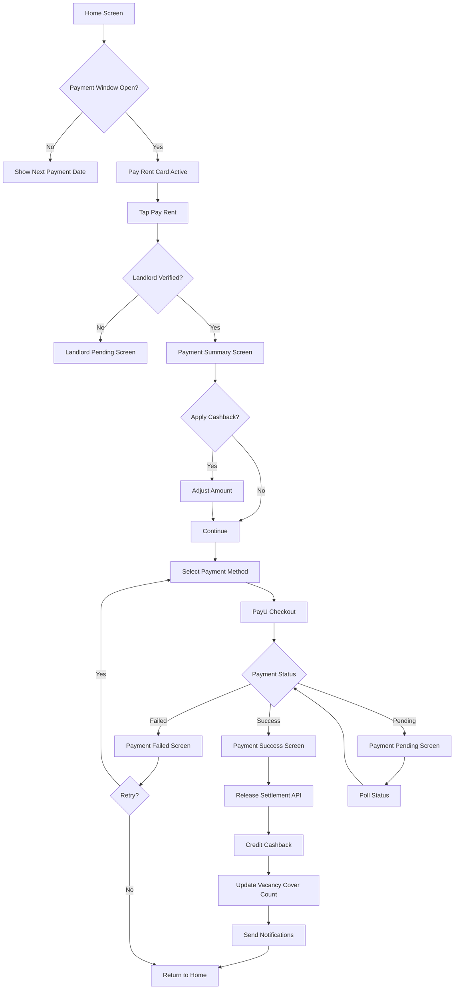

# F03: Payment Flow (PayU Split Settlement)

---
doc_type: flow
flow_id: F03
entities: [tenant, landlord, payment, cashback]
integrations: [payu, split_settlement]
status: approved
screens: [P01-P07]
---

## 📋 Flow Overview

**Goal:** Tenant pays rent, landlord receives 99%, tenant gets 1% cashback
**Duration:** 1-2 minutes
**Entry Point:** Home screen (payment window: 1st-7th of month)
**Exit Point:** Payment confirmed, settlement released

---

## 💰 Split Settlement Model

```
┌─────────────────────────────────────────────────────────────────────────────┐
│                         PAYMENT SPLIT MODEL                                 │
│                                                                             │
│   Tenant Pays: ₹25,000                                                      │
│   ─────────────────────────────────────────────────────────────────────    │
│                                                                             │
│   ┌─────────────────────────────────────────────────────────────────────┐  │
│   │                      PayU Split Settlement                          │  │
│   │                                                                     │  │
│   │   ┌─────────────────────────────┐  ┌─────────────────────────────┐ │  │
│   │   │  LANDLORD (Child Merchant)  │  │  SECURED (Parent Merchant)  │ │  │
│   │   │  ─────────────────────────  │  │  ─────────────────────────  │ │  │
│   │   │                             │  │                             │ │  │
│   │   │      ₹24,750 (99%)         │  │      ₹250 (1%)             │ │  │
│   │   │                             │  │                             │ │  │
│   │   │  Settlement: T+2 days       │  │  → Cashback to Tenant      │ │  │
│   │   │  To: HDFC ****7890          │  │                             │ │  │
│   │   │                             │  │                             │ │  │
│   │   └─────────────────────────────┘  └─────────────────────────────┘ │  │
│   │                                                                     │  │
│   └─────────────────────────────────────────────────────────────────────┘  │
│                                                                             │
│   PayU Fee: Deducted from parent merchant (Secured) portion                │
│                                                                             │
└─────────────────────────────────────────────────────────────────────────────┘
```

---

## 🗺️ Flow Diagram



---

## 📅 Payment Window Logic

```javascript
// Payment Window: 1st - 7th of each month
const PAYMENT_WINDOW = {
  start_day: 1,
  end_day: 7,
  timezone: 'Asia/Kolkata'
};

function isPaymentWindowOpen(date = new Date()) {
  const day = date.getDate();
  return day >= PAYMENT_WINDOW.start_day && day <= PAYMENT_WINDOW.end_day;
}

function getNextPaymentWindow(date = new Date()) {
  const currentMonth = date.getMonth();
  const currentDay = date.getDate();

  if (currentDay <= 7) {
    // Current window
    return {
      start: new Date(date.getFullYear(), currentMonth, 1),
      end: new Date(date.getFullYear(), currentMonth, 7)
    };
  } else {
    // Next month's window
    return {
      start: new Date(date.getFullYear(), currentMonth + 1, 1),
      end: new Date(date.getFullYear(), currentMonth + 1, 7)
    };
  }
}

// One payment per month validation
function canPayForMonth(tenancyId, month) {
  const existingPayment = db.rent_payments.findOne({
    tenancy_id: tenancyId,
    rent_month: month,
    status: ['SUCCESS', 'PENDING']
  });
  return !existingPayment;
}
```

---

## 📱 Screen Specifications

### P01: Home Screen (Payment Card)

```
┌─────────────────────────────────────────────────────────────────┐
│  Good morning, Priya 👋                              [Profile]  │
├─────────────────────────────────────────────────────────────────┤
│                                                                 │
│  ┌─────────────────────────────────────────────────────────┐   │
│  │  💳 Pay Rent                                            │   │
│  │  ──────────────────────────────────────────────────────│   │
│  │                                                         │   │
│  │  January 2025                                           │   │
│  │  302, Sunshine Apartments                               │   │
│  │                                                         │   │
│  │  ₹25,000                                               │   │
│  │  Due by 7th Jan                                         │   │
│  │                                                         │   │
│  │  ┌─────────────────────────────────────────────────┐   │   │
│  │  │            Pay Now                              │   │   │
│  │  └─────────────────────────────────────────────────┘   │   │
│  │                                                         │   │
│  │  🎁 Earn ₹250 cashback                                 │   │
│  │                                                         │   │
│  └─────────────────────────────────────────────────────────┘   │
│                                                                 │
│  ┌─────────────────────────────────────────────────────────┐   │
│  │  💰 Your Cashback                                       │   │
│  │  ──────────────────────────────────────────────────────│   │
│  │                                                         │   │
│  │  Available: ₹750                                        │   │
│  │  Pending: ₹250 (from Dec payment)                       │   │
│  │                                                         │   │
│  │  View History →                                         │   │
│  └─────────────────────────────────────────────────────────┘   │
│                                                                 │
│  ┌─────────────────────────────────────────────────────────┐   │
│  │  🛡️ Vacancy Cover                                       │   │
│  │  ──────────────────────────────────────────────────────│   │
│  │                                                         │   │
│  │  Status: 2/3 payments done                              │   │
│  │  ████████░░░░ Activates after 1 more payment           │   │
│  │                                                         │   │
│  └─────────────────────────────────────────────────────────┘   │
│                                                                 │
└─────────────────────────────────────────────────────────────────┘
```

**Payment Card States:**

| State | Display | Action |
|-------|---------|--------|
| `WINDOW_OPEN` | "Pay Now" button active | Enable tap |
| `WINDOW_CLOSED` | "Next payment: 1st Feb" | Disabled |
| `ALREADY_PAID` | "✓ Paid for January" | View receipt |
| `LANDLORD_PENDING` | "Waiting for landlord" | Disabled |
| `PROCESSING` | "Payment processing..." | Show spinner |

---

### P02: Payment Summary Screen

```
┌─────────────────────────────────────────────────────────────────┐
│  ←  Pay Rent                                                    │
├─────────────────────────────────────────────────────────────────┤
│                                                                 │
│  January 2025                                                   │
│                                                                 │
│  ┌─────────────────────────────────────────────────────────┐   │
│  │  📍 Property                                            │   │
│  │  302, Sunshine Apartments                               │   │
│  │  Koramangala, Bangalore                                 │   │
│  │                                                         │   │
│  │  👤 Landlord                                            │   │
│  │  Ramesh Kumar                                           │   │
│  └─────────────────────────────────────────────────────────┘   │
│                                                                 │
│  ┌─────────────────────────────────────────────────────────┐   │
│  │  Payment Breakdown                                      │   │
│  │  ──────────────────────────────────────────────────────│   │
│  │                                                         │   │
│  │  Rent Amount                          ₹25,000          │   │
│  │                                                         │   │
│  │  ┌─────────────────────────────────────────────────┐   │   │
│  │  │  🎁 Apply Cashback                              │   │   │
│  │  │                                                 │   │   │
│  │  │  Available: ₹750                                │   │   │
│  │  │                                                 │   │   │
│  │  │  ┌───────────────────────────────────────────┐ │   │   │
│  │  │  │  ₹  │  750                                │ │   │   │
│  │  │  └───────────────────────────────────────────┘ │   │   │
│  │  │                                                 │   │   │
│  │  │  [ ] Apply ₹750 cashback                       │   │   │
│  │  └─────────────────────────────────────────────────┘   │   │
│  │                                                         │   │
│  │  ──────────────────────────────────────────────────────│   │
│  │  You Pay                              ₹24,250          │   │
│  │  Cashback Applied                     -₹750            │   │
│  │  ──────────────────────────────────────────────────────│   │
│  │  New Cashback (1%)                    +₹243            │   │
│  │                                                         │   │
│  └─────────────────────────────────────────────────────────┘   │
│                                                                 │
│  ℹ️ Landlord receives ₹24,750 (99% of rent)                   │
│                                                                 │
│  ┌─────────────────────────────────────────────────────────┐   │
│  │              Proceed to Pay ₹24,250                     │   │
│  └─────────────────────────────────────────────────────────┘   │
│                                                                 │
└─────────────────────────────────────────────────────────────────┘
```

**Data Points:**
| Field | Type | Source | Editable |
|-------|------|--------|----------|
| `rent_month` | Date | Current month | No |
| `property_address` | String | Tenancy | No |
| `landlord_name` | String | Tenancy | No |
| `rent_amount` | Number | Tenancy | No |
| `cashback_available` | Number | Wallet | No |
| `cashback_to_apply` | Number | User input | Yes |
| `amount_to_pay` | Number | Calculated | No |
| `new_cashback_earned` | Number | Calculated | No |

**Calculations:**
```javascript
function calculatePayment(rentAmount, cashbackToApply) {
  const maxCashback = Math.min(cashbackToApply, rentAmount);

  return {
    rent_amount: rentAmount,
    cashback_applied: maxCashback,
    amount_to_pay: rentAmount - maxCashback,
    landlord_receives: Math.floor(rentAmount * 0.99),  // Always 99% of rent
    platform_fee: Math.ceil(rentAmount * 0.01),        // Always 1% of rent
    new_cashback: Math.floor(rentAmount * 0.01)        // 1% of rent as cashback
  };
}

// Example:
// Rent: ₹25,000, Cashback Applied: ₹750
// {
//   rent_amount: 25000,
//   cashback_applied: 750,
//   amount_to_pay: 24250,       // Tenant pays this
//   landlord_receives: 24750,   // Based on rent, not amount paid
//   platform_fee: 250,
//   new_cashback: 250           // Earned on full rent
// }
```

**Actions:**
| Action | Trigger | Next |
|--------|---------|------|
| Apply Cashback | Check box | Recalculate |
| Proceed to Pay | Button | P03 |
| Back | ← | P01 |

---

### P03: Payment Method Selection

```
┌─────────────────────────────────────────────────────────────────┐
│  ←  Select Payment Method                                       │
├─────────────────────────────────────────────────────────────────┤
│                                                                 │
│  Amount: ₹24,250                                               │
│                                                                 │
│  ┌─────────────────────────────────────────────────────────┐   │
│  │  UPI (Recommended)                                ⚡    │   │
│  │  ──────────────────────────────────────────────────────│   │
│  │                                                         │   │
│  │  ○ Google Pay                                           │   │
│  │  ○ PhonePe                                              │   │
│  │  ○ Paytm                                                │   │
│  │  ○ Other UPI                                            │   │
│  │                                                         │   │
│  └─────────────────────────────────────────────────────────┘   │
│                                                                 │
│  ┌─────────────────────────────────────────────────────────┐   │
│  │  Credit / Debit Card                                    │   │
│  │  ──────────────────────────────────────────────────────│   │
│  │                                                         │   │
│  │  ○ Add new card                                         │   │
│  │                                                         │   │
│  └─────────────────────────────────────────────────────────┘   │
│                                                                 │
│  ┌─────────────────────────────────────────────────────────┐   │
│  │  Net Banking                                            │   │
│  │  ──────────────────────────────────────────────────────│   │
│  │                                                         │   │
│  │  ○ HDFC Bank                                            │   │
│  │  ○ ICICI Bank                                           │   │
│  │  ○ SBI                                                  │   │
│  │  ○ Other banks →                                        │   │
│  │                                                         │   │
│  └─────────────────────────────────────────────────────────┘   │
│                                                                 │
│  🔒 Secured by PayU                                            │
│                                                                 │
│  ┌─────────────────────────────────────────────────────────┐   │
│  │              Pay ₹24,250                                │   │
│  └─────────────────────────────────────────────────────────┘   │
│                                                                 │
└─────────────────────────────────────────────────────────────────┘
```

**Payment Methods:**
| Method | Type | Notes |
|--------|------|-------|
| UPI - Google Pay | `UPI_INTENT` | Deep link |
| UPI - PhonePe | `UPI_INTENT` | Deep link |
| UPI - Paytm | `UPI_INTENT` | Deep link |
| UPI - Other | `UPI_COLLECT` | Enter VPA |
| Card | `CARD` | PayU hosted |
| Net Banking | `NB` | Bank redirect |

---

### P04: PayU Checkout (WebView / Redirect)

```
┌─────────────────────────────────────────────────────────────────┐
│  ←  Complete Payment                                            │
├─────────────────────────────────────────────────────────────────┤
│                                                                 │
│  ┌─────────────────────────────────────────────────────────┐   │
│  │                                                         │   │
│  │                    [PayU Checkout]                      │   │
│  │                                                         │   │
│  │     Payment Gateway Interface                           │   │
│  │     (WebView or In-App Browser)                         │   │
│  │                                                         │   │
│  │     - UPI PIN entry                                     │   │
│  │     - Card details                                      │   │
│  │     - Bank OTP                                          │   │
│  │                                                         │   │
│  └─────────────────────────────────────────────────────────┘   │
│                                                                 │
│  ⚠️ Do not close this screen until payment completes           │
│                                                                 │
└─────────────────────────────────────────────────────────────────┘
```

**PayU Integration:**
```javascript
// Create Payment Request with Split
const paymentRequest = {
  key: PAYU_MERCHANT_KEY,
  txnid: `RENT_${tenancyId}_${rentMonth}`,
  amount: amountToPay.toString(),
  productinfo: `Rent Payment - ${formatMonth(rentMonth)}`,
  firstname: tenantName,
  email: tenantEmail,
  phone: tenantPhone,

  // Split Settlement
  split_payments: JSON.stringify({
    splitInfo: [
      {
        merchantKey: landlordPayuKey,
        aggregatorSubTxnId: `RENT_LL_${tenancyId}_${rentMonth}`,
        aggregatorSubAmt: landlordAmount,  // 99% of rent
        aggregatorCharges: 0
      },
      {
        merchantKey: SECURED_PAYU_KEY,
        aggregatorSubTxnId: `RENT_PL_${tenancyId}_${rentMonth}`,
        aggregatorSubAmt: platformFee,      // 1% of rent
        aggregatorCharges: platformFee
      }
    ]
  }),

  surl: `${API_BASE}/payments/success`,
  furl: `${API_BASE}/payments/failure`,
  hash: calculateHash(...)
};
```

**Hash Calculation:**
```javascript
function calculatePayUHash(params) {
  const hashString = [
    params.key,
    params.txnid,
    params.amount,
    params.productinfo,
    params.firstname,
    params.email,
    '', '', '', '', '',  // udf1-udf5
    '',                   // empty
    '',                   // empty
    '',                   // empty
    '',                   // empty
    '',                   // empty
    PAYU_SALT,
    params.split_payments
  ].join('|');

  return crypto.createHash('sha512').update(hashString).digest('hex');
}
```

---

### P05: Payment Success Screen

```
┌─────────────────────────────────────────────────────────────────┐
│                                                                 │
│                                                                 │
│                           ✓                                     │
│                                                                 │
│                    Payment Successful!                          │
│                                                                 │
│                                                                 │
│  ┌─────────────────────────────────────────────────────────┐   │
│  │                                                         │   │
│  │  Amount Paid             ₹24,250                       │   │
│  │  Transaction ID          RENT_xyz_202501               │   │
│  │  Date                    5 Jan 2025, 10:30 AM          │   │
│  │                                                         │   │
│  │  ──────────────────────────────────────────────────────│   │
│  │                                                         │   │
│  │  Landlord Receives       ₹24,750                       │   │
│  │  Settlement by           7 Jan 2025                     │   │
│  │                                                         │   │
│  │  ──────────────────────────────────────────────────────│   │
│  │                                                         │   │
│  │  🎁 Cashback Earned      +₹250                         │   │
│  │     (Available after landlord settlement)              │   │
│  │                                                         │   │
│  └─────────────────────────────────────────────────────────┘   │
│                                                                 │
│  ┌─────────────────────────────────────────────────────────┐   │
│  │              Download Receipt                           │   │
│  └─────────────────────────────────────────────────────────┘   │
│                                                                 │
│  ┌─────────────────────────────────────────────────────────┐   │
│  │              Share Receipt                              │   │
│  └─────────────────────────────────────────────────────────┘   │
│                                                                 │
│                    Back to Home                                 │
│                                                                 │
└─────────────────────────────────────────────────────────────────┘
```

**Background Processing (on success):**
```javascript
async function handlePaymentSuccess(paymentData) {
  // 1. Verify payment with PayU
  const verified = await verifyPayUPayment(paymentData.txnid);

  // 2. Update payment record
  await db.rent_payments.update({
    where: { payu_txnid: paymentData.txnid },
    data: {
      status: 'SUCCESS',
      payu_payment_id: paymentData.mihpayid,
      payment_mode: paymentData.mode,
      completed_at: new Date()
    }
  });

  // 3. Release settlement to landlord
  await releaseSettlement(paymentData.landlord_sub_txnid);

  // 4. Credit cashback (pending until settlement)
  await db.cashback_ledger.create({
    tenant_id: paymentData.tenant_id,
    payment_id: paymentData.payment_id,
    amount: paymentData.cashback_amount,
    status: 'PENDING',
    earned_at: new Date()
  });

  // 5. Update vacancy cover payment count
  await updateVacancyCoverProgress(paymentData.tenancy_id);

  // 6. Send notifications
  await sendPaymentNotifications(paymentData);
}
```

**Release Settlement API:**
```json
POST https://info.payu.in/merchant/postservice
{
  "key": "secured_merchant_key",
  "command": "release_settlement",
  "var1": "RENT_LL_xyz_202501",
  "hash": "calculated_hash"
}

Response:
{
  "status": 1,
  "msg": "Settlement released successfully",
  "result": {
    "merchantKey": "landlord_key",
    "amount": 24750,
    "settlementDate": "2025-01-07"
  }
}
```

---

### P06: Payment Failed Screen

```
┌─────────────────────────────────────────────────────────────────┐
│                                                                 │
│                                                                 │
│                           ✗                                     │
│                                                                 │
│                    Payment Failed                               │
│                                                                 │
│                                                                 │
│  ┌─────────────────────────────────────────────────────────┐   │
│  │                                                         │   │
│  │  Reason: {failure_reason}                               │   │
│  │                                                         │   │
│  │  Transaction ID: RENT_xyz_202501                        │   │
│  │                                                         │   │
│  └─────────────────────────────────────────────────────────┘   │
│                                                                 │
│  Common reasons:                                                │
│  • Insufficient balance                                         │
│  • Bank declined transaction                                    │
│  • Session timeout                                              │
│                                                                 │
│  ┌─────────────────────────────────────────────────────────┐   │
│  │              Try Again                                  │   │
│  └─────────────────────────────────────────────────────────┘   │
│                                                                 │
│  ┌─────────────────────────────────────────────────────────┐   │
│  │              Try Different Method                       │   │
│  └─────────────────────────────────────────────────────────┘   │
│                                                                 │
│                    Back to Home                                 │
│                                                                 │
│  Payment window closes on 7th Jan. Contact support if issue    │
│  persists.                                                      │
│                                                                 │
└─────────────────────────────────────────────────────────────────┘
```

**Failure Codes:**
| Code | Message | Action |
|------|---------|--------|
| `E001` | Insufficient funds | Suggest different method |
| `E002` | Bank declined | Contact bank |
| `E003` | Session timeout | Retry |
| `E004` | Invalid card | Re-enter details |
| `E005` | UPI timeout | Retry UPI |
| `E006` | Technical error | Retry later |

---

### P07: Payment Pending Screen

```
┌─────────────────────────────────────────────────────────────────┐
│                                                                 │
│                                                                 │
│                          ⏳                                     │
│                                                                 │
│                    Payment Processing                           │
│                                                                 │
│                                                                 │
│  ┌─────────────────────────────────────────────────────────┐   │
│  │                                                         │   │
│  │  Your payment is being processed by the bank.           │   │
│  │                                                         │   │
│  │  Amount: ₹24,250                                        │   │
│  │  Transaction ID: RENT_xyz_202501                        │   │
│  │                                                         │   │
│  │  Status: Waiting for bank confirmation                  │   │
│  │                                                         │   │
│  └─────────────────────────────────────────────────────────┘   │
│                                                                 │
│  This usually takes a few minutes. We'll notify you once       │
│  confirmed.                                                     │
│                                                                 │
│  ⚠️ Please don't make another payment for this month.         │
│                                                                 │
│                    Back to Home                                 │
│                                                                 │
│  If not confirmed in 30 minutes, contact support.              │
│                                                                 │
└─────────────────────────────────────────────────────────────────┘
```

**Pending Payment Handling:**
```javascript
// Poll payment status
async function pollPaymentStatus(txnid, maxAttempts = 10) {
  for (let i = 0; i < maxAttempts; i++) {
    const status = await checkPayUStatus(txnid);

    if (status === 'success') {
      return handlePaymentSuccess(txnid);
    } else if (status === 'failure') {
      return handlePaymentFailure(txnid);
    }

    // Wait 30 seconds before next poll
    await sleep(30000);
  }

  // Mark as pending for manual review
  await markForManualReview(txnid);
}
```

---

## 🔄 Payment State Machine

```
┌─────────────────────────────────────────────────────────────────┐
│                    PAYMENT STATES                               │
│                                                                 │
│  ┌────────────┐                                                 │
│  │ INITIATED  │ ◄── User taps "Pay"                            │
│  └─────┬──────┘                                                 │
│        │ Redirect to PayU                                       │
│        ▼                                                        │
│  ┌────────────┐                                                 │
│  │  PENDING   │ ◄── At PayU checkout                           │
│  └─────┬──────┘                                                 │
│        │                                                        │
│        ├─────────────────┬─────────────────┐                   │
│        │ Success         │ Failed          │ Timeout           │
│        ▼                 ▼                 ▼                   │
│  ┌────────────┐   ┌────────────┐   ┌────────────┐             │
│  │  SUCCESS   │   │  FAILED    │   │  TIMEOUT   │             │
│  └─────┬──────┘   └────────────┘   └─────┬──────┘             │
│        │                                  │                     │
│        │ Release settlement               │ Poll status         │
│        ▼                                  ▼                     │
│  ┌─────────────────────┐          ┌────────────┐               │
│  │ SETTLEMENT_RELEASED │          │  PENDING   │ (loop)        │
│  └─────┬───────────────┘          └────────────┘               │
│        │                                                        │
│        │ PayU webhook                                           │
│        ▼                                                        │
│  ┌────────────┐                                                 │
│  │  SETTLED   │ ◄── Landlord received funds                    │
│  └────────────┘                                                 │
│                                                                 │
└─────────────────────────────────────────────────────────────────┘
```

---

## 📊 Database Schema

```sql
-- Rent Payments Table
CREATE TABLE rent_payments (
    id UUID PRIMARY KEY DEFAULT gen_random_uuid(),

    -- Relationships
    tenancy_id UUID NOT NULL REFERENCES tenancies(id),
    tenant_id UUID NOT NULL REFERENCES users(id),
    landlord_id UUID NOT NULL REFERENCES landlord_profiles(id),

    -- Payment Period
    rent_month DATE NOT NULL,  -- First of month

    -- Amounts
    rent_amount DECIMAL(10,2) NOT NULL,
    cashback_applied DECIMAL(10,2) DEFAULT 0,
    amount_paid DECIMAL(10,2) NOT NULL,
    landlord_amount DECIMAL(10,2) NOT NULL,
    platform_fee DECIMAL(10,2) NOT NULL,
    cashback_earned DECIMAL(10,2) NOT NULL,

    -- PayU Details
    payu_txnid VARCHAR(100) NOT NULL UNIQUE,
    payu_payment_id VARCHAR(100),
    payment_mode VARCHAR(50),
    landlord_sub_txnid VARCHAR(100),
    platform_sub_txnid VARCHAR(100),

    -- Status
    status VARCHAR(30) NOT NULL DEFAULT 'INITIATED',

    -- Settlement
    settlement_released_at TIMESTAMP,
    settlement_status VARCHAR(30),
    expected_settlement_date DATE,
    actual_settlement_date DATE,

    -- Timestamps
    initiated_at TIMESTAMP DEFAULT NOW(),
    completed_at TIMESTAMP,

    -- Constraints
    UNIQUE(tenancy_id, rent_month)
);
```

---

## 🔔 Notifications

### To Tenant (on success):
```
🎉 Payment Successful!

₹24,250 paid for January rent
Transaction: RENT_xyz_202501

Cashback earned: ₹250 🎁
(Available after settlement)

[View Receipt]
```

### To Landlord (on success):
```
💰 Rent Payment Received!

Priya Sharma has paid rent for January.

Amount: ₹24,750
Expected settlement: 7 Jan 2025
Bank: HDFC ****7890

[View Details]
```

### To Landlord (on settlement):
```
✓ Rent Settled to Your Account

₹24,750 for January rent has been
credited to HDFC ****7890.

Tenant: Priya Sharma
Property: 302, Sunshine Apartments
```

---

## 🚨 Edge Cases

| Scenario | Handling |
|----------|----------|
| **Double payment attempt** | Block at DB (unique constraint) |
| **Payment outside window** | Disable button, show next date |
| **Landlord not verified** | Block payment, show status |
| **Cashback > Rent** | Cap at rent amount |
| **Split creation fails** | Retry 3x, then refund |
| **Settlement release fails** | Queue for retry, alert ops |
| **Webhook missed** | Poll PayU for status |
| **Partial settlement** | Flag for manual review |

---

## 🔗 Connected Flows

| Trigger | Target Flow | Condition |
|---------|-------------|-----------|
| 3rd successful payment | [F06: Vacancy Cover](./F06_VACANCY_COVER.md) | Activate cover |
| Cashback credited | Wallet update | After settlement |
| Payment failed | Retry flow | User choice |

